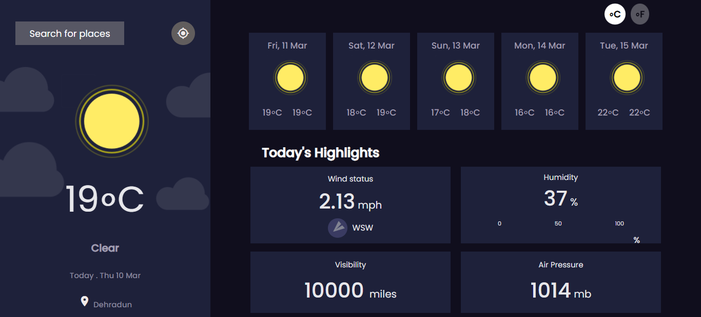

<h2>Weather App</h2>

This is my solution to <strong>Weather App</strong> challenge by Frontendmentor.io. which displays the current weather along with the weather updates of next 5 days of the searched city.

<h3>Live Link</h3>
<a href="https://sonakshirawat.github.io/Weather-App/">Click here</a>

<h3>Features</h3>
<ul>
<li>Displays the current weather along with the weather updates of next 5 days of the searched city.</li>
<li> We can switch temperature between Fahrenheit and celcius.</li>
<li> Display temperature, visibility, Air pressure, humidity, wind speed.</li>
<li> Receive an error message when the `form` is submitted if the `input` field is empty</li>
<li>See the hover states for all the interactive elements on the page</li>
<li>View the optimal layout for the site depending on their device's screen size</li>
<li>API used: openweathermap API.</li>
</ul>

 
<h3>Build Using</h3>
<ul>
  <li>HTML5 Markup language</li>
  <li>CSS3 Custom Properties</li>
     <li>Vanilla javascript</li>
</ul>

<h3>Screenshots</h3>
 

